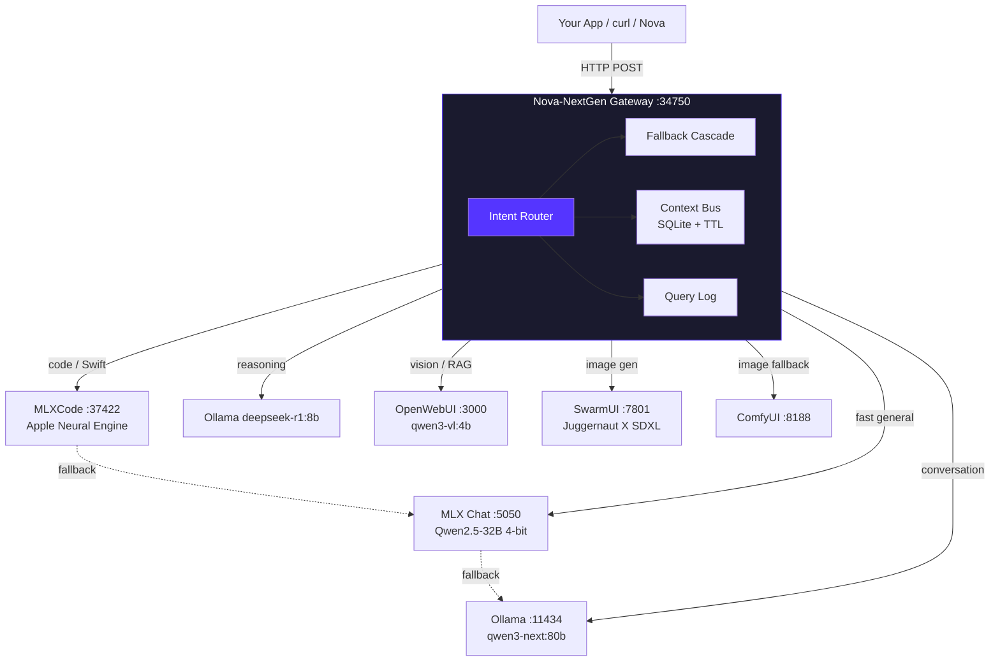
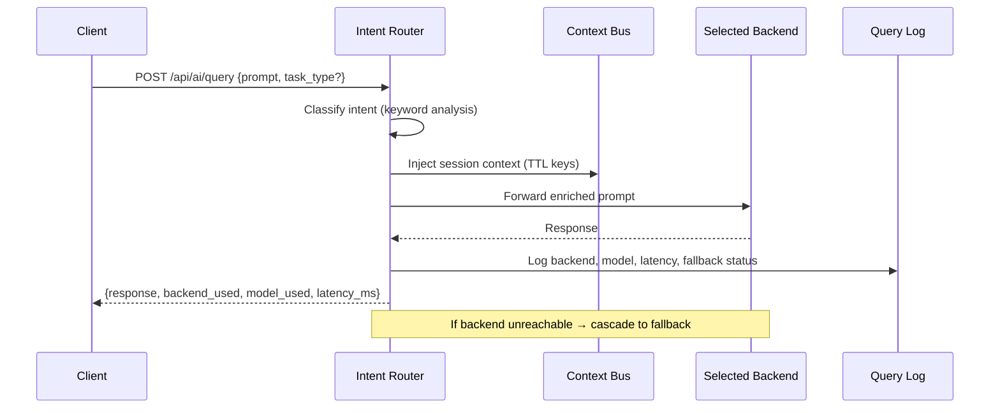

# Nova-NextGen AI Gateway

> **ARCHIVED** — This repo has been merged into [kochj23/nova](https://github.com/kochj23/nova). See that repo for active development.

A local-first AI routing gateway for macOS. One endpoint, multiple backends, automatic intent detection. Queries arrive at a single FastAPI server on port 34750 and get dispatched to whichever local AI engine is best suited for the task — coding goes to the code model, reasoning goes to the reasoning model, images go to the image generator. No manual model selection required.

Written by Jordan Koch ([kochj23](https://github.com/kochj23)).


---

## Hardware

- **Mac Studio M4 Ultra** — 512GB unified memory
- **Memory system:** 1,224,900 vectors across 409 domains (PostgreSQL 17 + pgvector)

---

## Architecture



---

## Features

- **Automatic intent routing** — keyword analysis maps prompts to the right backend without manual `task_type`
- **Multiple backend integrations** — MLXCode, MLX Chat, Ollama, OpenWebUI, SwarmUI, ComfyUI
- **Fallback cascading** — if the primary backend is unreachable, the router tries the next best option automatically
- **Cross-model consensus validation** — run a prompt through multiple backends and compare outputs using cosine similarity scoring
- **Shared context bus** — SQLite-backed key/value store with TTL, injected into prompts automatically
- **Session tracking and analytics** — every query logged with backend, model, latency, fallback status
- **Drop-in Swift client** — `AIService.swift` gives any Xcode project async/await access
- **LaunchAgent integration** — starts on login, auto-restarts on crash
- **Loopback-only by default** — binds to 127.0.0.1

---

## Backends

| Backend | Port | Model | Strength |
|---------|------|-------|----------|
| **MLXCode** | 37422 | mlx-local (custom) | Swift, coding, debugging on Apple Neural Engine |
| **MLX Chat** | 5050 | Qwen2.5-32B-4bit | Fast general text, speculative decoding |
| **Ollama** | 11434 | qwen3-next:80b | Conversation, complex reasoning |
| **Ollama (reasoning)** | 11434 | deepseek-r1:8b | Chain-of-thought, logic |
| **OpenWebUI** | 3000 | qwen3-vl:4b | RAG, vision, multimodal |
| **SwarmUI** | 7801 | Juggernaut X SDXL | Image generation |
| **ComfyUI** | 8188 | workflow-based | Image fallback |

---

## Request Flow



---

## Quick Start

```bash
git clone https://github.com/kochj23/Nova-NextGen.git
cd Nova-NextGen
python3 -m venv venv && source venv/bin/activate
pip install -r requirements.txt
python3 nova_gateway.py
```

The gateway starts on `http://127.0.0.1:34750`.

```bash
# Health check
curl http://localhost:34750/health

# Route a coding prompt
curl -X POST http://localhost:34750/api/ai/query \
  -H "Content-Type: application/json" \
  -d '{"prompt": "Write a Swift struct for a network request"}'

# Force a specific backend
curl -X POST http://localhost:34750/api/ai/query \
  -H "Content-Type: application/json" \
  -d '{"prompt": "Explain monads", "preferred_backend": "ollama", "model": "deepseek-r1:8b"}'

# Full gateway status
curl http://localhost:34750/api/status
```

---

## API Reference

### `POST /api/ai/query`

| Field | Type | Default | Description |
|-------|------|---------|-------------|
| `prompt` | string | required | The prompt to route |
| `task_type` | string | auto | Override routing: `code`, `reasoning`, `image`, `quick`, `rag` |
| `preferred_backend` | string | null | Force a specific backend by name |
| `model` | string | null | Override the model (backend-specific) |
| `session_id` | string | null | Use existing context bus session |
| `validate` | bool | false | Enable cross-model consensus validation |

Response includes: `response`, `backend_used`, `model_used`, `latency_ms`, `fallback_used`, `consensus_score`.

### `GET /api/status`
Full gateway snapshot: uptime, version, all backend health with latency, session count, total queries.

### `POST /api/ai/validate`
Force cross-model consensus — sends to multiple backends, compares with cosine similarity.

### `GET /health`
Liveness probe: `{"status": "ok"}`.

---

## Analytics

Every query is logged to SQLite with: session ID, task type, backend, model, prompt/response lengths, latency, fallback status, validation status.

```bash
# View recent queries
sqlite3 ~/.nova_gateway/queries.db \
  "SELECT task_type, backend_used, latency_ms FROM query_log ORDER BY id DESC LIMIT 20;"
```

---

## Swift Client

Include `AIService.swift` in any Xcode project:

```swift
let result = try await AIService.shared.query(
    prompt: "Fix this Swift code: \(code)",
    taskType: .code
)
print(result.response)
```

---

## Installation as LaunchAgent

```bash
python3 install.py
# Creates ~/Library/LaunchAgents/net.digitalnoise.nova-nextgen.plist
# Auto-starts on login, auto-restarts on crash
```

---

## License

MIT License — see [LICENSE](LICENSE).

Written by Jordan Koch ([@kochj23](https://github.com/kochj23))
